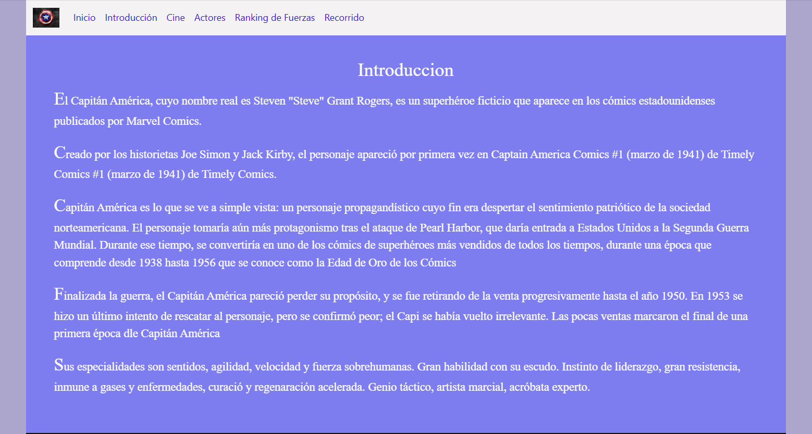
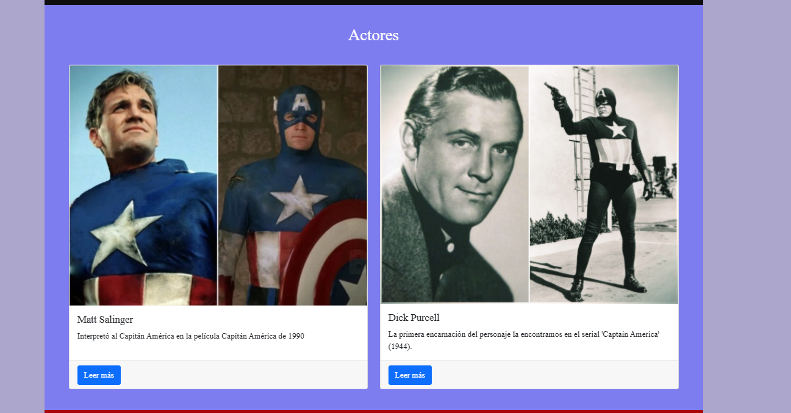

<h1>Memoria del proyecto de Lenguajes de Marcas Recuperación - 1ºDAM</h1>
<h2>Capitán América</h2>
<h2>Índice</h2>
<ul>
  <li><a href="#introduccion">Introducción</li>
  <li><a href="#motivacion">Motivación del proyecto</li>
  <li><a href="#estructura">Estructura</li>
  <li><a href="#estilo">Estilo</li>
  <li><a href="#snippets">Code Snippets</li>
</ul>

<h2 id="introduccion">Introduccion</h2>

Trabajo realizado en clase por: María Lucía López López

Proyecto web de 4ªEvaluación de Lenguajes de Marcas Recuperación de trabajos de 2ªEvaluación

17 de Junio de 2024

Licencia CC-BY

<h2 id="motivacion">Motivación</h2>

He realizado la página sobre uno de los superheroes más famosos en este caso la he hecho de Capitán America porque me gusta como se defiende y los poderes que tiene y desde que veo la película de Marvel es el superheroe que más me atrae. A mi me gustaría mostraros los puntos positivos y negativos a través de mi página usando principalmente bootstrap.

<h2 id="estructura">Estructura del proyecto</h2>

La página web está dividida en seis secciones las cuales nombraremos ahora

<ul>
  <li>Inicio</li>
  <li>Introducción</li>
  <li>Cine</li>
  <li>Actores</li>
  <li>Ranking de fuerzas</li>
  <li>Recorrido</li>
  <li>Contacto</li>
</ul>
<h3>Inicio</h3>

He utilizado un carousel con diferentes imágenes de Capitán América que hace buen contraste con los colores de mi página

<h3>Introducción</h3>

Está compuesto por un resumen sobre la vida del superheroe

<h3>Cine</h3>

Está compuesto por un resumen sobre el recorrido del cine de capitán américa y una foto de un cartel de una película de Capitán América

<h3>Actores</h3>

Está compuesta por dos cards con dos actores qu ehan representado a Capitán América en películas o comics. Y contiene un botón que si clicas en él te sale más información sobre los actores

<h3>Ranking de fuerzas</h3>

Está sección está compuesta por una tabla con el orden de los 10 primeros superhéroes más fuertes junto a sus habilidades y su poder

<h3>Recorrido</h3>

Está compuesta sobre un resumen contando todo el reocrrido del vengador y con un vídeo de la canción de Capitán América

<h3>Contacto</h3>

<h2 id="estilo">Estilo de la página</h2>
<h3>Paleta de colores</h3>

He usado tonos azules grisaceos, rojos, azules, y blanco que son los colores que caracterizan al superheroe que hemos elegido

<h3>Tipografias</h3>

He usado FiraSans-Light

Y Railway-PlyE

Fuentes obtenidas de:

<ul>
  <li>https://www.1001fonts.com</li>
</ul>
<h3>Imágenes</h3>

Imágenes obtenidas de páginas oficiales que hablan sobre Capitán América en Google

<h2>Code Snippets</h2>

He usado los siguientes:

<ul>
  <li>Carrousel</li>
  <li>Slider</li>
  <li>Card-gallery</li>
</ul>
